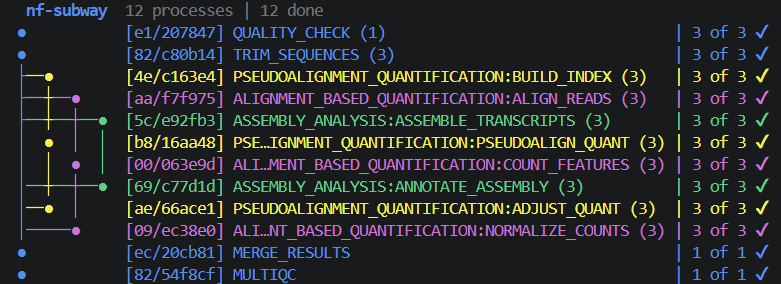

# nf-subway

A TUI that turns your Nextflow pipeline into a live colored lanes, animated nodes, and real-time progress inside your terminal.



## Install

```bash
pip install git+https://github.com/damouzo/nf-subway.git
```

## Usage

```bash
nextflow run pipeline.nf | nf-subway
```

That's it. By default the original Nextflow output is hidden. Add `--original` to show both:

```bash
nextflow run pipeline.nf | nf-subway --original
```

## Status indicators

| Symbol | Color | Meaning |
|--------|-------|---------|
| `●` (blinking) | blue | running |
| `●` | green | completed |
| `○` | yellow | cached (`-resume`) |
| `X` | red | failed |

## License

MIT License - see LICENSE file for details

## Acknowledgments

- Inspired by the clean aesthetics of git-graph visualizations
- Built with [Rich](https://github.com/Textualize/rich) for terminal rendering
- Designed for the [Nextflow](https://www.nextflow.io/) workflow system
